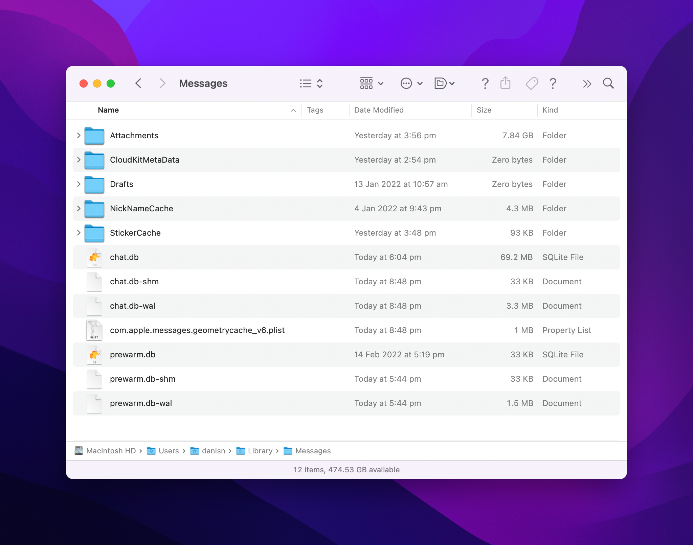
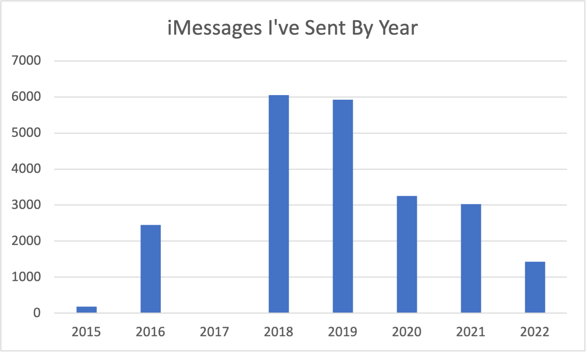

# imessage-db

_Learning more about SQL and SQLite by exploring my Apple Messages Data._
___

## Step 1: Collect Messages Data

Apple stores iMessage Data locally in an SQLite Database named 'chat.db'


```bash
--> ~ ls -lah /Users/danlsn/Library/Messages
total 161064
drwx------@  15 danlsn  staff   480B 20 Feb 20:48 .
drwx------+ 107 danlsn  staff   3.3K 16 Feb 15:53 ..
-rw-r--r--@   1 danlsn  staff   8.0K 20 Feb 20:54 .DS_Store
drwx------@ 252 danlsn  staff   7.9K 19 Feb 15:56 Attachments
drwx------@   2 danlsn  staff    64B 19 Feb 14:54 CloudKitMetaData
drwxr-xr-x@   3 danlsn  staff    96B 13 Jan 10:57 Drafts
drwxrwxrwx@  18 danlsn  staff   576B  4 Jan 21:43 NickNameCache
drwx------@  11 danlsn  staff   352B 19 Feb 15:48 StickerCache
-rw-r--r--@   1 danlsn  staff    66M 20 Feb 18:04 chat.db
-rw-r--r--@   1 danlsn  staff    32K 20 Feb 20:48 chat.db-shm
-rw-r--r--@   1 danlsn  staff   3.2M 20 Feb 20:48 chat.db-wal
-rw-r--r--@   1 danlsn  staff   1.0M 20 Feb 20:48 com.apple.messages.geometrycache_v6.plist
-rw-r--r--@   1 danlsn  staff    32K 14 Feb 17:19 prewarm.db
-rw-r--r--@   1 danlsn  staff    32K 20 Feb 17:44 prewarm.db-shm
-rw-r--r--@   1 danlsn  staff   1.4M 20 Feb 17:44 prewarm.db-wal
```

___

## Step 2: Start Hacking on It

### 1. How many messages have I sent on iMessage?

```sqlite
---All Messages
SELECT count(*) count
FROM main.message;

+-----+
|count|
+-----+
|48944|
+-----+

---Sent By Me
select count(*) count
from main.message
where message.is_from_me = 1;

+-----+
|count|
+-----+
|22321|
+-----+

---Received By Me
select count(*) count
from main.message
where message.is_from_me = 0;

+-----+
|count|
+-----+
|26623|
+-----+
```

### 2. How many messages have I sent per year?

The date column in the 'messages' table is recorded as nanoseconds since 2001-01-01.

```sqlite
--Select Messages I've Sent Grouped By Date
select date(message.date / 1000000000 + strftime("%s", "2001-01-01"), "unixepoch", "localtime") date_time,
       count(ROWID)                                                                             count
from message
where message.is_from_me = 1
group by date_time
order by count desc
limit 10;

+----------+-----+
|date_time |count|
+----------+-----+
|2018-09-21|282  |
|2018-09-24|251  |
|2022-01-03|227  |
|2022-01-11|222  |
|2018-09-22|180  |
|2018-10-24|165  |
|2018-12-20|164  |
|2019-05-27|163  |
|2019-09-21|152  |
|2018-10-02|150  |
+----------+-----+
```

> So far so good! Now it's time to bucket the dates by year instead!

```sqlite
--Select Messages I've Sent Grouped by Year
select strftime("%Y",
                date(message.date / 1000000000 + strftime("%s", "2001-01-01"), "unixepoch", "localtime")) date_time,
       count(ROWID)                                                                                       count
from message
where message.is_from_me = 1
group by date_time
order by date_time desc;

+---------+-----+
|date_time|count|
+---------+-----+
|2022     |1432 |
|2021     |3033 |
|2020     |3254 |
|2019     |5918 |
|2018     |6046 |
|2017     |1    |
|2016     |2449 |
|2015     |188  |
+---------+-----+
```



#### Questions:

1. What happened in 2017?
    1. Well, I had an Android Phone in 2017.
2. Why has iMessage usage dropped dramatically since 2020?
    1. Most of my messaging happens on Messenger now
3. And, 2015?
    1. Back then most of my messaging was in WhatsApp!

## 3. How Many iMessages are Sent vs. SMS?

```sqlite
--Select Messages Sent by Me and Group By Type
select count(*) count, message.service service
from message
group by service
order by count desc;

+-----+--------+
|count|service |
+-----+--------+
|42948|iMessage|
|5996 |SMS     |
+-----+--------+
```

## 4. How Many Messages Sent in 'The Boys' Group Chat?

```sqlite
--How Many Messages Sent in 'The Boys' Group Chat?

--Select ROWID for the Group Chat
select ROWID, display_name
from chat
where display_name like 'The Boys';

+-----+------------+
|ROWID|display_name|
+-----+------------+
|3    |The Boys    |
+-----+------------+

--Select Count of All Messages with the right chat_id
select chat_id, count(*) count
from chat_message_join
where chat_id = (select ROWID from chat where display_name like 'The Boys');

+-------+-----+
|chat_id|count|
+-------+-----+
|3      |3505 |
+-------+-----+
```

## 5. How many messages grouped by group chat name?

```sqlite
--Join Chat and Message Tables by chat_message_join, group by display_name
select display_name, count(*) count
from chat
         join chat_message_join cmj on chat.ROWID = cmj.chat_id
         join message m on cmj.message_id = m.ROWID
where display_name not like ""
group by display_name
order by count desc;

+------------------------------------+-----+
|display_name                        |count|
+------------------------------------+-----+
|The Boys                            |3505 |
|House Maxleigh ISO                  |306  |
|Koala Kids - Photog & Cinematography|27   |
|Koala Kids Dinner                   |13   |
|Koala Kids                          |8    |
+------------------------------------+-----+
```

## 6. How much data has been sent in Attachments?

```sqlite
--How many total bytes of attachments?
select str(sum(total_bytes)) total_bytes
from attachment;

+-----------+
|total_bytes|
+-----------+
|9706223350 |
+-----------+

--Bytes of Attachments Grouped By UTI
select uti, sum(total_bytes) total_bytes
from attachment
group by uti
order by total_bytes desc
limit 10;

+---------------------------------------------+-----------+
|uti                                          |total_bytes|
+---------------------------------------------+-----------+
|com.apple.quicktime-movie                    |5112106511 |
|public.jpeg                                  |2873301725 |
|public.heic                                  |830067782  |
|public.png                                   |255029744  |
|public.mpeg-4                                |225392291  |
|dyn.age81a5dzq7y066dbtf0g82peqf4hk2pdrb00n5xy|155572241  |
|com.apple.m4v-video                          |113088672  |
|com.adobe.raw-image                          |77530021   |
|com.compuserve.gif                           |34474884   |
|com.adobe.pdf                                |11116671   |
+---------------------------------------------+-----------+
```

## 7. Who have I sent and received the most messages from?

```sqlite
--Select Messages Grouped by Handle
select *
from chat c
         cross join chat_handle_join chj on c.ROWID = chj.chat_id
         cross join message m on chj.handle_id = m.handle_id

--Work in Progress...
```

## 8. How Many Unique Phone Numbers Have I Sent Messages To?

```sqlite
--Join message and handle tables on ROWID
select count(*) count, h.id handle_id
from message m
        cross join handle h on h.ROWID = m.handle_id
where m.is_from_me = 1
group by handle_id
order by count desc
limit 5;

+-----+------------+
|count|handle_id   |
+-----+------------+
|976  |+61403xxxxxx|
|362  |+61425xxxxxx|
|113  |+61417xxxxxx|
|57   |+61425xxxxxx|
|37   |+61403xxxxxx|
+-----+------------+
```

___
